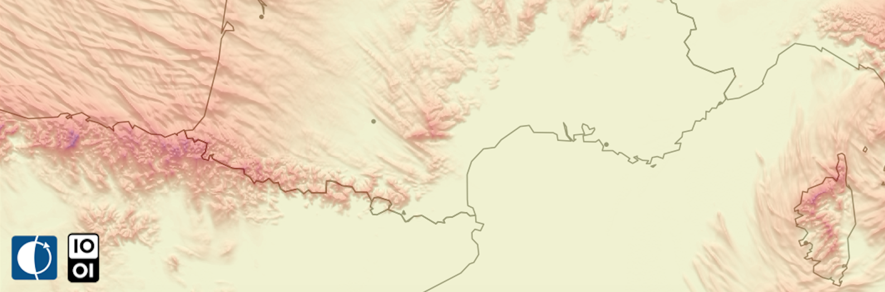

# Pluiff : la pluie en gif

 
  

Pluiff est réalisé grâce aux données ouvertes publiées par **Meteo-France**. ~ tous les soirs, il :

- récupère les données de prévisions de précipitation à J+1 du [modèle Arpège](https://donneespubliques.meteofrance.fr/?fond=produit&id_produit=131&id_rubrique=51)  mises à disposition en J à 12h par Météo-France (en licence ouverte etalab 👍 ).

- géoréférence les 24 images HD au format tiff, correspondant aux prévisions de la quantité de précipitations heure par heure sur J+1

-	les convertit en format raster

- les cartographie grâce une plage de couleur viridis et de l’ombrage pour donner une impression visuelle de 3D grâce aux bons tuyaux de [Matt Strimas-Mackey](http://strimas.com/r/snowfall/)

-	ajoute des infos spatiales de contexte (frontières, grandes villes…) récupérées publiées par [Natural Earth Data](http://www.naturalearthdata.com/downloads/10m-cultural-vectors/10m-admin-0-details/) ou [l’IGN](http://professionnels.ign.fr/adminexpress)

- exporte les 24 images finalisées avec les infos d’horaires en png

-	les réimporte pour les assembler en un gif

-	publie le résultat (un gif heure par heure des prévisions de précipitations pour le lendemain ainsi qu'une image en HD) sur [son compte twitter pluiff](https://twitter.com/pluiff)